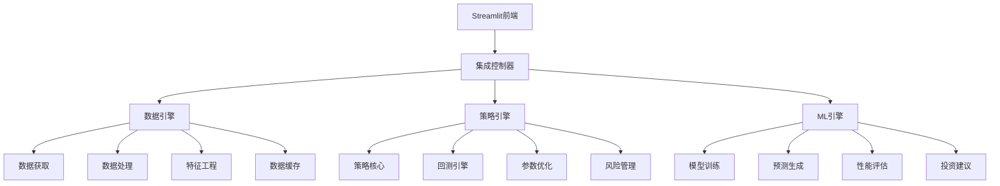

# 🚀 QuantAI Trader - AI驱动的量化交易系统

[](https://share.streamlit.io/deploy)
[](https://www.python.org/downloads/)
[](https://opensource.org/licenses/MIT)
[](https://github.com/yourusername/quant-system/actions)

> 🎯 专业级量化交易系统，集成数据获取、策略回测、机器学习预测于一体

## ✨ 核心特性

### 📊 数据引擎
- **多数据源支持**: Yahoo Finance, Alpha Vantage, Tushare
- **实时数据获取**: 股票、期货、加密货币数据
- **智能数据处理**: 缺失值处理、异常值检测、数据标准化
- **高效缓存机制**: 减少API调用，提升性能

### 🎯 策略引擎
- **丰富策略库**: 双均线、MACD、RSI、布林带、动量策略
- **参数自动优化**: 网格搜索、遗传算法、贝叶斯优化
- **完整回测框架**: 滑点、手续费、风险管理
- **多维度分析**: 夏普比率、最大回撤、胜率分析

### 🤖 AI预测引擎
- **多模型支持**: XGBoost, Random Forest, LSTM, Linear Regression
- **智能特征工程**: 技术指标、价格模式、时间序列特征
- **模型性能评估**: 准确率、精确率、召回率、F1分数
- **投资建议生成**: 基于AI预测的智能投资建议

### 🌐 Web界面
- **现代化设计**: 响应式布局，移动端适配
- **实时交互**: 参数调整实时更新图表
- **专业图表**: 资金曲线、收益分布、风险分析
- **一键部署**: Streamlit Cloud无缝部署

## 🏗️ 系统架构



## 🚀 快速开始

### 方式一：一键部署到Streamlit Cloud ⭐

1. **Fork本项目** 到你的GitHub账户
2. **访问** [share.streamlit.io](https://share.streamlit.io)
3. **连接GitHub** 并选择fork的仓库
4. **设置主文件** 为 `streamlit_app.py`
5. **点击Deploy** 开始部署

### 方式二：本地运行

```bash
# 1. 克隆项目
git clone https://github.com/yourusername/quant-system.git
cd quant-system

# 2. 创建虚拟环境
python -m venv venv
source venv/bin/activate  # Windows: venv\Scripts\activate

# 3. 安装依赖
pip install -r requirements.txt

# 4. 运行应用
streamlit run streamlit_app.py
```

### 方式三：Docker部署

```bash
# 构建镜像
docker build -t quant-system .

# 运行容器
docker run -p 8501:8501 quant-system
```

## 📚 使用指南

### 🎯 策略回测

1. **选择股票代码**: 输入如 AAPL, TSLA, MSFT
2. **配置策略**: 选择策略类型和参数
3. **设置时间范围**: 选择回测开始和结束日期
4. **运行回测**: 查看策略表现和关键指标
5. **分析结果**: 资金曲线、风险指标、交易明细

```python
# 快速回测示例
from integration import quick_backtest

results = quick_backtest(
    symbol="AAPL", 
    strategy="moving_average", 
    days=365
)
```

### 🤖 机器学习预测

1. **数据准备**: 获取历史数据和特征
2. **模型选择**: XGBoost, Random Forest, LSTM等
3. **训练模型**: 自动特征工程和模型训练
4. **预测分析**: 生成未来价格预测
5. **投资建议**: 基于预测结果的智能建议

```python
# ML预测示例
system = QuantSystem()
ml_results = system.ml_engine.run_ml_pipeline(
    symbol="AAPL",
    start_date="2023-01-01",
    end_date="2024-01-01",
    model_type="xgboost"
)
```

## 📊 示例结果

### 策略回测结果
| 指标 | 数值 |
|------|------|
| 总收益率 | 15.23% |
| 夏普比率 | 1.45 |
| 最大回撤 | 8.76% |
| 胜率 | 62.5% |

### ML模型性能
| 模型 | 准确率 | F1分数 |
|------|---------|--------|
| XGBoost | 0.687 | 0.652 |
| Random Forest | 0.654 | 0.621 |
| LSTM | 0.612 | 0.589 |

## 🔧 配置说明

### 环境变量
```bash
# API密钥 (可选)
ALPHA_VANTAGE_API_KEY=your_api_key
TUSHARE_TOKEN=your_token

# 数据库配置 (可选)
DATABASE_URL=sqlite:///data/trading.db

# 缓存配置
CACHE_TTL=3600
CACHE_SIZE=1000
```

### Streamlit配置
位于 `.streamlit/config.toml`:
```toml
[theme]
primaryColor = "#1f77b4"
backgroundColor = "#ffffff"
secondaryBackgroundColor = "#f0f2f6"
textColor = "#31333f"
```

## 📁 项目结构

```
📦 quant-system/
├── 📄 streamlit_app.py           # Streamlit主应用
├── 📄 integration.py             # 系统集成模块
├── 📄 requirements.txt           # Python依赖
├── 📁 .streamlit/               # Streamlit配置
│   └── 📄 config.toml
├── 📁 .github/                  # GitHub Actions
│   └── 📁 workflows/
│       └── 📄 deploy.yml
├── 📁 data_engine/             # 数据引擎模块
├── 📁 strategy_core/           # 策略核心模块
├── 📁 ml_integration/          # 机器学习模块
├── 📁 tests/                   # 测试文件
└── 📄 README.md                # 项目文档
```

## 🧪 测试

```bash
# 运行所有测试
pytest tests/

# 运行特定测试
pytest tests/test_integration.py

# 生成覆盖率报告
pytest --cov=./ --cov-report=html
```

## 🤝 贡献指南

我们欢迎任何形式的贡献！

1. **Fork** 项目
2. **创建** 特性分支 (`git checkout -b feature/AmazingFeature`)
3. **提交** 更改 (`git commit -m 'Add some AmazingFeature'`)
4. **推送** 到分支 (`git push origin feature/AmazingFeature`)
5. **创建** Pull Request

### 开发环境设置

```bash
# 安装开发依赖
pip install -r requirements.txt
pip install pytest black flake8

# 代码格式化
black .

# 代码检查
flake8 .

# 运行测试
pytest
```

## 📈 路线图

- [ ] **v1.1** - 增加更多技术指标
- [ ] **v1.2** - 支持加密货币交易
- [ ] **v1.3** - 实时交易执行
- [ ] **v1.4** - 投资组合优化
- [ ] **v2.0** - 多资产类别支持

## ⚠️ 风险提示

**重要声明**: 
- 本系统仅用于学习和研究目的
- 不构成任何投资建议
- 投资有风险，入市需谨慎
- 请在充分了解风险的情况下使用

## 📞 技术支持

- **GitHub Issues**: [提交问题](https://github.com/yourusername/quant-system/issues)
- **文档**: [查看文档](https://github.com/yourusername/quant-system/wiki)
- **讨论**: [参与讨论](https://github.com/yourusername/quant-system/discussions)

## 📄 许可证

本项目采用 MIT 许可证 - 查看 [LICENSE](LICENSE) 文件了解详情

## 🙏 致谢

感谢以下开源项目：
- [Streamlit](https://streamlit.io/) - Web应用框架
- [Plotly](https://plotly.com/) - 交互式图表
- [Pandas](https://pandas.pydata.org/) - 数据处理
- [Scikit-learn](https://scikit-learn.org/) - 机器学习

---

<div align="center">

**⭐ 如果这个项目对你有帮助，请给它一个星标！**

[🚀 立即部署](https://share.streamlit.io/deploy) | [📖 查看文档](https://github.com/yourusername/quant-system/wiki) | [💬 加入讨论](https://github.com/yourusername/quant-system/discussions)

</div> 